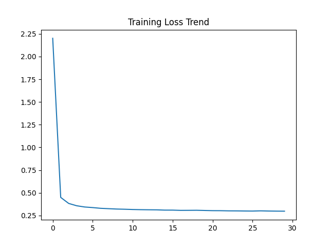

# 中文文档
参考spectrum模板
## ABSTRACT
（includeing）
- Introduction
- Method
- Results
- Conclusion
- Word Count - Max300 words
- Keywords 5-6 keywords

## INTRODUCTION

## METHODS
### 2.1 Dataset
本研究采用 VQA-RAD 数据集开展医学视觉问答任务。VQA-RAD 包含 315 张放射医学图像（包括 X 光和 CT），以及 2,247 对经临床医生验证的问题–答案（QA）样本。与依赖外部医学知识库的数据集（如 SLAKE）不同，VQA-RAD 主要关注“纯视觉”问题，即答案可直接从图像内容中推断。这一特性使其适合用于评估模型的视觉表征学习能力及视觉–语言对齐能力。

数据集中问题类型包括封闭式问题和开放式问题，其中封闭式问题占 57.7%，开放式问题占 42.3%。问题内容涵盖异常存在、解剖位置以及成像模态等多个医学方面。需要注意的是，约 19.6% 的问题存在重复，这对模型评估提出了更高要求，以避免模型过度依赖文本模式而非视觉信息。

在实验设置中，数据集按照 80:20 的比例随机划分为训练集和测试集。所有图像均被调整为 
224
×
224
224×224 像素，并进行归一化处理，以满足预训练 CLIP 图像编码器的输入要求。文本数据经过分词处理，并被组织为因果语言建模格式（如“Question: [Q] Answer: [A]”），以支持生成式学习过程。
配图1：关于VQA-RAD 数据集统计信息
配图2: 数据处理流程示意图
## RESULTS
### generative model
首先是训sonsbeek的训练过程的results，可以看到早期的loss曲线快速下降,最显著的特征是epoch0到epoch1的垂直下降，这完全符合sonsbeek等人架构的预期，由于visionEncoder(clip)和languistic model（gpt-2）都是预训练好并且被冻结的，他们已经具备了非常强的特征提取和语言生成能力，模型不需要从0开始旭熙，mapping network只需要学习一个简单的线性变化来对齐视觉和语言，因此模型在初期训练能迅速找到最优解的大致方向。
从ecpoch5开始，曲线进入plateau，loss稳定在0.3左右，并且线条十分平滑，没有剧烈震荡，这个平滑的曲线恰好说明了lr=1e-4和优化器adamW设置得比较合适，没有出现梯度爆炸和震荡。这种loss曲线过早平滑也暗示了vqa-rad数据集比较小，模型能很快记住训练集中的所有简单映射规则，并且，mapping network是一个简单mlp，容量有限，并且主干被冻结了，很难在这种不解冻主干的情况下挖掘出更深层的语义规律。
总的来说，这张图说明了我们的代码是可行的，并且

## DISCUSSION
## CONCLUSION
## ACKNOWLEDGEMENT
## AUTHORS CONTRIBUTION
## REFERENCES (统一插入即可,先不写，zotero有统一插入功能)
## APENDIX